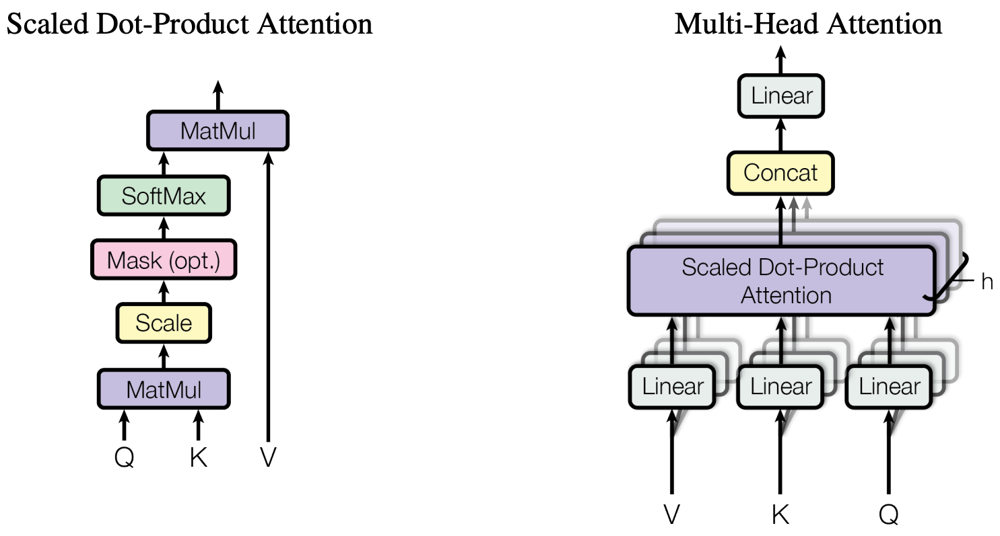

# transformer-model-in-PyTorch

- Transformer
  - A Transformer is a neural network architecture introduced in the 2017 paper ["Attention is All You Need"](https://arxiv.org/pdf/1706.03762) -- it is the foundation of virtually every modern large language model (GPT, BERT, Claude, etc.).  
- PyTorch
  - PyTorch is an open-source machine learning library based on the Torch library, used for applications such as computer vision and natural language processing, primarily developed by Facebook's AI Research lab (FAIR).
  - Tutorial: https://docs.pytorch.org/tutorials/index.html
- Transformer Architecture
  - < Architecture >
    - The Transformer architecture is based on a self-attention mechanism that allows the model to weigh the importance of different words in a sentence when making predictions. It consists of an encoder and a decoder, each made up of multiple layers of self-attention and feed-forward neural networks.
    - 
  - < layers >
    - [ Encoder Layer ]  
    The EncoderLayer class defines a single layer of the transformer's encoder. It encapsulates a multi-head self-attention mechanism followed by the position-wise feed-forward neural network, with residual connections, layer normalization, and dropout applied as appropriate. Together, these components allow the encoder to capture complex relationships in the input data and transform them into a useful representation for downstream tasks. Typically, multiple such encoder layers are stacked to form the complete encoder part of a transformer model.
    
  - < sub layers >
    - [ Multi-Head Attention ]
      - Mechanism to focus on different parts of the input. Captures dependencies across different positions in the sequence
      - 
      - <em>[learn more](https://campus.datacamp.com/courses/large-language-models-llms-concepts/training-methodology-and-techniques?ex=8#)</em>
    - [ Position-wise Feed-Forward Networks (FFN) ]
      - FFN is the neural network part that processes each token independently after attention.
      - It consists of two linear transformations with a ReLU activation in between.
        - The 1st linear layer expands the dimensionality of the input (512 → 2048).
        - The 2nd linear layer projects it back to the original dimension (2048 → 512).
        - Formula: FFN(x) = max(0,xW1 + b1)W2 + b2
    - [ Positional Encoding ]
      - The PositionalEncoding class adds information about the position of tokens within the sequence. Since the 
      transformer model lacks inherent knowledge of the order of tokens (due to its self-attention mechanism), this 
      class helps the model to consider the position of tokens in the sequence. The sinusoidal functions used are 
      chosen to allow the model to easily learn to attend to relative positions, as they produce a unique and smooth 
      encoding for each position in the sequence.
- Reference
  - https://arxiv.org/pdf/1706.03762
  - https://www.datacamp.com/tutorial/building-a-transformer-with-py-torch
  - https://www.geeksforgeeks.org/deep-learning/transformer-using-pytorch/