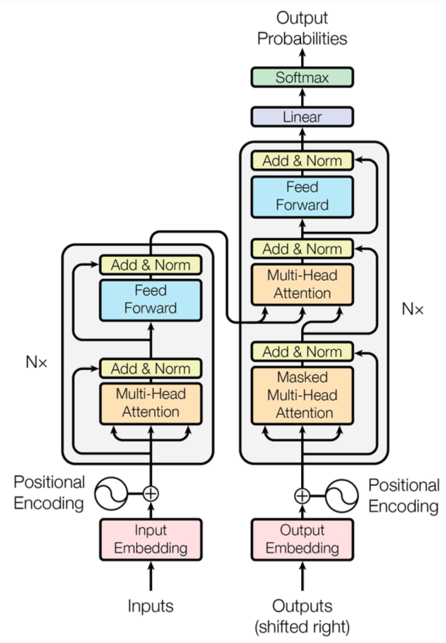

# transformer-model-in-PyTorch

- Transformer
  - A Transformer is a neural network architecture introduced in the 2017 paper ["Attention is All You Need"](https://arxiv.org/pdf/1706.03762) -- it is the foundation of virtually every modern large language model (GPT, BERT, Claude, etc.).  
- PyTorch
  - PyTorch is an open-source machine learning library based on the Torch library, used for applications such as computer vision and natural language processing, primarily developed by Facebook's AI Research lab (FAIR).
  - Tutorial: https://docs.pytorch.org/tutorials/index.html
- Transformer Architecture
  - The Transformer architecture is based on a self-attention mechanism that allows the model to weigh the importance of different words in a sentence when making predictions. It consists of an encoder and a decoder, each made up of multiple layers of self-attention and feed-forward neural networks.
  - 
- Reference
  - https://arxiv.org/pdf/1706.03762
  - https://www.datacamp.com/tutorial/building-a-transformer-with-py-torch
  - https://www.geeksforgeeks.org/deep-learning/transformer-using-pytorch/